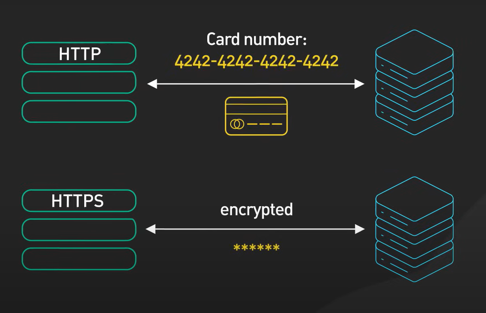

# HTTP Nedir?

**Hypertext Transfer Protocol (HTTP)**, internet üzerinden web tarayıcısı ile web sunucusu arasında veri iletimi (Data Transmission/Communication) için kullanılan bir **web protokolüdür** [3].

HTTP, istemci-sunucu (Client-Server) modeliyle çalışır:

[4]: HTTP protokolü, istemci (web tarayıcısı) ile sunucu (web sitesinin sunucusu) arasında bağlantı kurulmasını sağlar.

**Application Layer**'da çalışır ve metin, ses, görüntü gibi hipermedya kaynaklarının iletiminde standartları belirler.

Günlük hayatta sıkça yaptığımız, tarayıcı uygulamasına istediğimiz web sitesi adresini girip ilgili web sayfasını görüntülemeyi; 4 adımda, "bilgisayarlar nasıl birbirleriyle iletişim kuruyor?" sorusunu da aklımızda tutarak inceleyelim:

---

## Adım 1: Uniform Resource Locator (URL) Girme

Chrome gibi bir tarayıcıda gitmek istediğimiz web sitesinin adresini girdiğimizde, istekte bulunduğumuz ve internetin herhangi bir yerinde bulunan karşıdaki bilgisayar (**sunucu**), HTTP protokolü üzerinden bu web sayfasını indirmemiz için bize gönderir [1]. 

Aşağıdaki görselde olduğu gibi **http://** ya da **https://** ile başlayan **Uniform Resource Locator (URL)** adresini girdiğimizde, tarayıcı bu URL adresi için HTTP protokolü üzerinden dosya getirmesi gerektiğini anlar.

http://atasam.atauni.edu.tr/
Başta yazan **http://** ifadesi önemlidir. Burası protokol veya şema (scheme) olarak adlandırılır.

Başka bir örnekte, dosya indirme ve yükleme için FTP (File Transfer Protocol) de kullanılabilir:
ftp://ftp.debian.org/debian/

---

## Adım 2: Tarayıcının IP Çözümlemesi

atasam.atauni.edu.tr gibi URL'leri tarayıcımıza girdiğimizde, bu **alan adı** (**domain name**), **Domain Name System (DNS)** protokolü tarafından doğru IP adresine **DNS resolver** ile dönüştürülür (mapping).

Eğer hedef sunucunun IP adresini biliyorsak, doğrudan da aratabiliriz. 

Örneğin, tarayıcımıza 34.218.62.116 yazarsak, aslında bu IP adresinde HTTP protokolünde bir web sayfası çalıştığını ve bize https://www.geeksforgeeks.org/ adresini döndürdüğünü görebiliriz.

Tarayıcı, bu alan adının IP’sini bilmediğinde, bilgisayarın **işletim sistemine** sorar.

İşletim sistemi şu sırayla kontrol eder:

1. Bilgisayardaki Hosts dosyası
2. DNS önbelleği (cache)
3. DNS Resolver: Ağa bağlı olan DNS sunucusu (genellikle modemden gelir; modem de ISS’nin DNS’ine bağlıdır)
4. Gerekirse root DNS sunucularına kadar giderek çözüm yapılır.

IP adresi bulunduğunda, tarayıcı artık o sunucuya HTTP/HTTPS isteği gönderebilir.

---

## Adım 3: Tarayıcı HTTP İsteği Gönderir

Tarayıcı, sunucu ile arasında TCP (üçlü el sıkışma ile) bağlantısı kurar. Modern tarayıcılar bu işlemi hızlandırmak için **keep-alive connection** denilen HTTP persistent bağlantısını kullanır.

Tarayıcı, gitmek istediğimiz hedef IP adresini belirleyince HTTP **request** (istek) gönderir.

Bu istek, karşı bilgisayardaki dosyaları edinip web sayfasını görüntüleyebilmemiz için **GET** metodu ile gönderilmiştir.

Yukarıda, Postman yazılımında GET metodu ile http://atasam.atauni.edu.tr/ adresine istek atılmıştır. Gelen mesajda **status: 200** değeri yer alıyor; bunun anlamını birazdan öğreneceğiz.

---

## Adım 4: HTTP Response Alınır

Eğer istek başarılıysa, dosyalar bize gelir ve web sitesini tarayıcıda görüntüleyebiliriz.

Gelen **HTML** dosyasını "preview" butonuna tıklayarak inceleyebiliriz:

Yani, tarayıcımızdan URL girip arattığımızda, web sitesi aslınd arka planda bu 4 aşamadan geçip karşımıza gelir!

---

## Postman Yazılımı

Postman yazılımı, genel olarak API oluşturmak ve API yaşam döngüsünü (life-cycle) gözlemlemek/yönetmek amacıyla geliştirilmiştir [2].

Az önce yaptığımız gibi, HTTP protokolü ile **GET** ve **POST** gibi istekleri atmak için bu uygulamayı kullandık. Burp Suite yazılımı da benzer amaçlarla kullanılabilir.

---

## HTTP Request Metotları

Amaçlarına ve başarılı olduklarında ne beklendiğine göre HTTP istek metotları farklılık gösterir [8]: 

1. **GET:** Sunucudan veri almak için kullanılır. Sunucuda herhangi bir değişiklik yapmaz.
2. **POST:** Sunucuya veri göndermek ve genellikle sunucuda bir değişiklik yapmak için kullanılır (ör. form gönderimi).
3. **HEAD:** GET ile aynı şekilde çalışır fakat sadece başlık (header) bilgisini döndürür, gövde (body) verisi gönderilmez.
4. **PUT:** Sunucuda belirtilen kaynağı oluşturmak veya güncellemek için kullanılır.
5. **DELETE:** Belirtilen kaynağı sunucudan silmek için kullanılır.
6. **PATCH:** Belirtilen kaynağın kısmi olarak güncellenmesi için kullanılır.
7. **OPTIONS:** Sunucunun desteklediği HTTP metotlarını sorgulamak için kullanılır.

---
## HTTP Headers

HTTP başlıkları sayesinde bu isteiğin zamanını, karşıdaki sunucunun Apache olduğunu ve daha bir çok şeyi öğreniyoruz.

---

## HTTP Status Kodları

HTTP durum (status) kodları 100 ile 599 arasındaki sayılardır ve her aralık belirli bir anlam kategorisini ifade eder:

[5] Durum kodları 5 ana kategoride değerlendirilir:

- **Bilgilendirme (Informational) [100-199]**
- **Başarılı (Success) [200-299]**
- **Yönlendirme (Redirection) [300-399]**
- **İstemci hatası (Client Error) [400-499]**
- **Sunucu hatası (Server Error) [500-599]**

**Örnekler:**
- **Status: 200** – Başarılı istek, içerik döndürüldü.
- **Status: 404** – İstenen kaynak bulunamadı.
- **Status: 500** – Sunucu tarafında bir hata oluştu.

---

## HTTP Sürümleri

- **HTTP/1.0:** İlk sürüm, her istek için ayrı bağlantı açılır.
- **HTTP/1.1:** Persistent connection (keep-alive) desteği ile daha verimli bağlantı yönetimi sağlar.
- **HTTP/2:** Çoklu isteklerin aynı bağlantı üzerinden iletilmesi (multiplexing) ile daha hızlı ve verimlidir.
- **HTTP/3:** QUIC protokolü üzerine kurulu olup, daha düşük gecikme ve daha iyi güvenlik sunar.

---

## HTTPS

Kısaca, HTTPS daha güvenli bir HTTP protokolüdür.

HTTP verileri **düz metin (plain text)** olarak taşır; bu da aradaki başka bir cihazın bu verileri okuyabilmesi anlamına gelir. Bu nedenle, güvenli olmayan web sitelerinde kredi kartı gibi hassas bilgilerin girilmemesi önerilir.

Diğer taraftan, HTTPS **şifreleme** (encryption) algoritmalarını kullandığı için HTTP**S**ecure olarak adlandırılır.

[7]: HTTPS, kullanılan algoritmalar sayesinde gönderilen verilerin şifrelenmesini sağlar. Veri paketleri ağdaki başka bir cihaz tarafından yakalansa dahi, bu veriler anlamlı şekilde okunamaz.

[6]: İstemci ve sunucu arasında asimetrik şifreleme ve anahtar değişimi vardır.

**Secure Socket Layer (SSL)** ve daha günceli olan **Transport Layer Security (TLS)** şifreleme için kullanılır. **Private** ve **Public Key** anahtarları oluşturulur.

[7]: İlk olarak, istemci ve sunucu arasında TCP el sıkışması ile bir bağlantı kurulur. -- Buraya kadar HTTP ile aynıdır.

Ardından, istemci sunucunun kimliğini doğrulamak için **sertifikasını** kontrol eder. Bu doğrulama aşamasından sonra, anahtar değişimi (Key Exchange) ile iki taraf da veriyi şifrelemek için kullanılacak olan oturum anahtarını (session key) belirler ve son olarak bu anahtar kullanılarak güvenli veri aktarımı başlar.

Sertifika kontrol aşamasında, sunucudan gelen sertifika tarayıcımız üzerinden görüntülenebilir.

---

## Özet

1. Tarayıcımızın adres çubuğuna http://atasam.atauni.edu.tr/ gibi bir URL girdiğimizde, tarayıcı web sayfasını indirip bize gösterirken şu protokolleri kullanır:  
   - **HTTP:** Tarayıcıya, sunucudan hangi dosyayı alması gerektiğini belirtmek için.  
   - **TCP:** Tüm IP paketlerinin kesin ve sırayla geldiğinden emin olmak için.  
   - **IP:** İstemci ve sunucunun IP adreslerine göre doğru IP paket yönlendirmesini (routing) yapmak için. 

2. Hypertext Transfer Protocol üzerinden sadece metin veya HTML dosyası değil; sitenin font dosyası, JavaScript dosyaları, resimler, logolar gibi diğer hipermedya dosyaları da gelir.

Örneğin, aşağıdaki URL girişimizi tarayıcının "inspect/incele" fonksiyonunda "network" kısmına tıklayarak inceleyebiliriz. Sol tarafta birçok içeriğin geldiği gözükür; işte tüm bu dosyalar HTTP ile gelmiştir ve hangi method ile ne döndüğü, durum kodu ile beraber yazmaktadır:

Üzerine tıkladığımızda, paket içeriği detaylı bir şekilde karşımıza çıkar:

3. Bir web tarayıcısı, bir web sayfasına erişmek için bir web sunucusuna **HTTP isteği** (request) gönderir. Web sunucusu bu isteğe karşılık, web sayfasının içeriğini **HTTP yanıtı** (response) ile geri gönderir. Bu sayede, tarayıcı sayfayı görüntüleyebilir.

---

## Quiz

- **keep-alive connection** denilen HTTP persistent iletişimi nedir?
Tek bir kurulan bağlantı içinde gerekli tüm dosyaları almak.
- RSA Sertifikası nedir?
Açık anahtar şifreleme ile...
- HTTP ile HTTPS arasındaki temel farklar nelerdir?
- Bir HTTP isteğinde hangi başlıklar (headers) bulunabilir?
- Status: 404 ne anlama gelir?

---

## Referanslar

[1]: https://www.khanacademy.org/computing/computers-and-internet/xcae6f4a7ff015e7d:the-internet/xcae6f4a7ff015e7d:web-protocols/a/hypertext-transfer-protocol-http Erişim Tarihi: 25.08.2025  
[2]: Postman Resmi Dökümantasyonu: https://learning.postman.com/docs/ Erişim Tarihi: 25.08.2025  
[3]: https://www.lenovo.com/in/en/glossary/hypertext-transfer-protocol/ Erişim Tarihi: 25.08.2025  
[4]: https://www.geeksforgeeks.org/computer-networks/web-protocols/# Erişim Tarihi: 25.08.2025  
[5]: https://itnext.io/api-calls-and-http-status-codes-e0240f78f585 Erişim Tarihi: 25.08.2025  
[6]: https://www.geeksforgeeks.org/html/explain-working-of-https/ Erişim Tarihi: 25.08.2025  
[7]: https://youtu.be/j9QmMEWmcfo?si=xWRici7NRUYadwFT Erişim Tarihi: 25.08.2025  
[8]: https://developer.mozilla.org/en-US/docs/Web/HTTP/Reference/Methods Erişim Tarihi: 25.08.2025