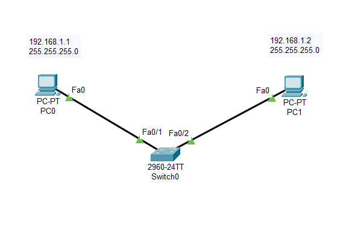

# OSI Modeli ve TCP/IP Stack

Open Systems Interconnection **(OSI)** ve Transmission Control Protocol/Internet Protokol **(TCP/IP) Stack** kavramları **bilgisayar ağları** üzerine araştırma yapmaya başladığımızda karşımıza çıkan ilk konulardandır.

Bugün etrafımızı çevreleyen ve günlük hayatımızda sıklıkla kullandığımız yazılım projeleri, makine koduna doğru her **soyutlama/abstraction** katmanında bir takım garantilere güveniyor ve binlerce insanın ortak çalışması ile geliştirilen standart/protokol ve teknolojilerin üzerine inşa edilip sektörde yer bulabiliyor yahut sorunumuzu çözüyor [1]. 

Bilgi teorisinden bildiğimiz üzere iki cihaz arasında gürültüsüz ve hatasız bir fiziksel kanal inşa etmek mümkün değildir ancak bu fiziksel kanalın üzerine **mantıksal**/yöntemsel TCP (adı üstünde Transmission Control) gibi protokolleri uygulamamız sayesinde paketlerin eksiksiz ve doğru sırada ulaştığından yani kanal boyunca güvenilir bir iletişim sağlandından emin olabiliyoruz  [1]. -- kanalın dinlendiğine dair düşüncemizi ihmal edersek.

Bu makalenin yazılma motivasyonu ise, "bilgisayarlar nasıl birbirleriyle iletişim kuruyor?" gibi temel bir sorunun altını deşmek, "**under the hood**" [2] denilen yani soyutlama derecesinin az olduğu yerlerde, ne ve hangi işlemlerin olduğunu ağ özelinde anlamak. -- her ne kadar kara, sihirli kutu düşüncesi daha kolay olsa da [2].

Bu süreçte, Cisco Packet Tracer kullanarak basitten karmaşığa doğru ağ topolojileri kuracağız. Yolumuzun üstünde OSI ve TCP/IP kavramlarının soyutlama katmanları da uygulamalı olarak karşımıza çıkacaktır.
## Cisco Packet Tracer

Cisco Networking Academy tarafından geliştirilmiş packet tracer programı birazdan kuracağımız ağ mimarilerinde başta, iletişimi yani kanal boyunca gönderilen mesajları simüle edilmiş öğrenme ortamında takip edip, ağları dizayn ve konfigüre etmemize yarayan CCNA seviyesi karmaşıklığında bir yazılımdır [3]. Ben 8.2.2 versiyonunu kullanmaktayım.
## Ağ Topolojileri
Ağ topolojisi, bir ağdaki cihazların birbirine nasıl bağlandığını ve iletişim kurduğunu gösteren yapıdır. Ağ topoloji diyagramları, ağın mantıksal ve fiziksel düzenini görsel olarak ifade ederek kullanıcıların ağı anlamasına ve oluşabilecek sorunları gidermesine (troubleshooting) yardımcı olur.

## Cisco Packet Tracer Uygulamaları

**1.  İki cihaz arasında ping yollama:**

Aşağıdakı basit ağ topolojisini inceleyelim. 2  bilgisayar Fast Ethernet ile birbirine bağlanmış; IP ile subnetmask değerleri görseldeki gibi.

Pc0 dan Pc1 e ping yolladığımızda packet tracer programının simülasyon ekranında **ICMP**  (Internet Control Message Protocol) üzerinden bağlantı olduğu gösterilmiş. Tıkladığımızda,
    

aşağıda PC1 in PDU bilgisi gösterilmekte. -- PDU Nedir?
Açılan ekranın sol üst köşesinde OSI Modeli yazmakta ve 1 den 7 ye kadar katmanlar bulunmakta. Yalnız sadece ilk 3 katman seviyesinde kalmış, birazdan daha ileri iletişim mimarilerinde komplike yani katman derecesi yüksek iletişim çeşitleri göreceğiz.
Peki neden Layer 3?

**2. ARP işlemi:**
Bu sefer az önceki iki cihazımızın arasında switch var.

Yine PC0 dan PC1'e paket yollamak istediğimizde bu sefer aradaki switch üzerinden geçip ICMP (ping, traceroute komutları ile atılabilir -- "cihazın ben buradayım sen de orada mısın?" sorgusu diyebiliriz) den önce olarak ARP tipinde mesaj yolladığını da görüyoruz.

Aşağıda, ARP işleminin layer 2 katmanında gerçekleştiğini söylüyor. Aslında bu işlem az öncekinden bir katman aşağıda diye soyutlama derecesi düşük yani daha az karmaşık bir olay olarak niteleyebiliriz.
Layer 2 katmanında çalışmasının nedeni switch imizin (Layer 3 de çalışan switchler de vardır) PC0 ın benzersiz MAC adresini ARP tablosuna kaydetmesini gösteriyor. IP düzeyinde bir işlem olmadığı için layer 3 diyemiyoruz.

Hedef MAC adresi (Dest. MAC) olarak FFFF.FFFF.FFFF yani broadcast (yayın) adresi kullanılmış, buradaki işlemi şöyle özetleyebiliriz:

ARP protokolü, OSI modelinde Layer 2 (Veri Bağlantı Katmanı) ile Layer 3 (Ağ Katmanı) arasında bir geçiş görevi görür. Bunun nedeni, Layer 3'teki bir IP adresini, Layer 2'deki bir MAC adresine dönüştürmesidir.

**3. DHCP sunucusundan IP alma:**

Aşağıdaki ağ mimarisini inceleyelim:

PC 2 switch üzerinden Router2 den IPv4 daha genel ifadeyle otomatik olarak IP adresi, alt ağ maskesi, varsayılan ağ geçidi gibi bilgileri talep ediyor. 

Aşağıdaki görselde, DHCP (Dynamic Host Configuration Protocol) protokolü uygulama katmanında çalıştığı için layer 7 olarak gösterilmiş. DHCP serverın, yani Router2 nin, bu DHCP paketini **process** ettiğini görüyoruz.
Ayrıca Layer 4'te **UDP** (User Datagram Protocol) protokolünün kullanıldığını da görüyoruz. Birazdan tek tek katmanları inceleyince burada gördüklerimiz daha çok anlam ifade edecek.

## OSI Modeli

Makineler arası iletişimin (network) modellenmesi fikri yeni olmasa da, 1984 yılında International Organization for Standardization (ISO) tarafından oluşturulan OSI modeli güncelliğini korumakta ve hâlâ geliştirilmeye devam etmektedir.
(https://www.iso.org/ics/35.100/x/)

İletişimin veri üzerinden olduğu bilgisayar ağlarında aşağıdaki 7 ayrı farklı katmanın her birinin kendi **alan/domain**'i olmakla beraber, bir sonraki ya da önceki komşu katmana bu veri iletir.

OSI Modeli'nin 7 Katmanı [2]

Yukarıdan, 7.katmandan aşağıya 1. katmana doğru sırasıyla her bir katmanı ayrı ayrı inceleyelim. Dediğimiz gibi her bir katmanın kendine özgü yapıp ettikleri, elindeki veriyi hemen bir sonraki komşu katmana - bazen bu veriye meta-data ekleyerek (**encapsulation**) - ilettikleri bir **katmanlı referans/conceptual model** anlayışından söz ediyoruz.

Şunu da not etmek gerek: receiving/alıcı side ve sending/gönderici side tarafını aşağıda inceleyelim; gönderici tarafında her bir katmanın yaptığı işlem, alıcı tarafında yine aynı katmanda bu sefer işlemin tersi olacak şekilde yapılır. Örnek olarak encapsulation ile de-encapsulation.

Receiver ve sender [4]

Ayrıca şekildeki gibi soyutlama derecesinin az olduğu ilk 3 katman donanım düzeyindeki işlemleri ifade ettiği içim donanım katmanları; diğer açıdan son kullanıcının daha çok etkileşime girdiği tarafa, yazılım katmanı ve bu iki tarafın ortasında köprü görevi gören Layer 4, yani veri iletiminden sorumlu olan Transport Layer olarak kategorize edebiliriz.

## Layer 7: Application

Son kullanıcının etkileşime girdiği yazılım ürünleri genellikle bu katmandadır. 
Örneğin kullandığımız web browser/tarayıcı **HTTP** protokolü üzerinden çalışır.
**Process-to-process** iletişim buradadır.

## Layer 6: Presentation

Bu katmanın yaptığı 3 ana fonksiyon vardır:
1. **Data translation**
2. **Encryption & decryption**  
Bu katmanda verinin güvenliğini sağlamak için şifreleme (ör. AES, DES) ve şifre çözme işlemleri yapılır.  
3. **Compression**  
GZIP ve LZ77 gibi algoritmalar, veri hacmini azaltmak için burada kullanılabilir [4].

Aslında günümüz interneti ve TCP/IP yapısında, veri formatı dönüşümü gibi işlemler genellikle Application katmanında gerçekleştirilir [2]. Bu nedenle, OSI modelindeki Presentation ve Session katmanları, TCP/IP Stack'te tek bir katmanda (Application) birleştirilmiştir.

## Layer 5: Session

Session Layer (Oturum Katmanı), iki cihazdaki uygulamalar arasında oturumların başlatılmasını, yönetilmesini ve sonlandırılmasını sağlar. Yani, veri alışverişi sırasında bağlantının ne zaman başlayıp ne zaman biteceğini kontrol eder.

## Layer 4: Transport

Bu katmanda **host-to-host** (uçtan uca) iletişim sağlanır, yani iki farklı cihazdaki uygulamalar arasında veri transferi gerçekleşir. Transport Layer, veriyi daha küçük parçalara (segment) böler ve alıcıda bu segmentleri tekrar birleştirir (reassemble). Burada kullanılan Protokol Data Unit (PDU) adı **Segment**'tir.

Bu katmanda **TCP** ve **UDP** protokolleri bulunur.  
- **TCP (Transmission Control Protocol):** Bağlantı tabanlıdır, veri iletiminde güvenilirlik ve sıralama sağlar. -- Üçlü el sıkışma.
- **UDP (User Datagram Protocol):** Bağlantısızdır, daha hızlıdır fakat veri iletiminde güvenilirlik ve sıralama garantisi yoktur.

## Layer 3: Network
Bu katmanda, kaynak (source) ve hedef (destination) arasında yol seçimi (**path selection**) ve yönlendirme (**routing**) işlemleri gerçekleştirilir. Farklı ağlar (network) arasında veri iletimi ve uç cihazlara bağlantı sağlama görevi Network Layer'a aittir.

Bu katmana bazen "Internet katmanı" da denir, çünkü IP (Internet Protocol) ile ilgili işlemler burada yapılır. Örneğin, ilk uygulamamızda ping komutu ile ICMP protokolü üzerinden PDU göndermiştik. Simülasyonda aşağıdaki gibi bir çıktı görmüştük:

- Source IP (Kaynak IP): 192.168.1.1 (PC0'ın IP adresi)
- Destination IP (Hedef IP): 192.168.1.2 (PC1'in IP adresi)
## Layer 2: Data-Link

Bu katmanda, fiziksel katmanda (Physical Layer) oluşabilecek hata ve bozulmaların tespiti ve düzeltilmesi sağlanır. Yani, iletim sırasında ortaya çıkabilecek **bit hataları** (örneğin, elektriksel parazit nedeniyle bir bitin yanlış okunması) burada kontrol edilir ve mümkünse düzeltilir. Ayrıca, veri paketleri bu katmanda **frame** (çerçeve) adı verilen yapılara dönüştürülür ve ağ üzerindeki cihazların (ör. switch, network kartı) birbirini tanıması için MAC adresleri kullanılır.

**PDU (Protocol Data Unit)**: Frame (Çerçeve)

## Layer 1: Phsyical
Bu katman, verinin ağ üzerinden bitler (0 ve 1'ler) halinde fiziksel olarak iletilmesinden sorumludur. Yani, elektriksel sinyaller, ışık darbeleri veya radyo dalgaları gibi fiziksel yollarla veri aktarımı burada gerçekleşir. Bu katmanda PDU (Protocol Data Unit) bireysel veri bitleridir.

**Örnek**: Cat6 ethernet kablosu, fiber optik kablo, radyo dalgaları.

---

## TCP/IP Stack

TCP/IP daha az katmanda modelleme yapar [2]. 

TCP/IP Stack, TCP/IP Suite veya TCP/IP Model gibi farklı isimlerle literatürde yer alsa da, internetin çalışmasını sağlayan birçok protokolü bir arada barındırdığı için genellikle "stack" (yığın) veya "suite" (takım) olarak adlandırılır.

TCP/IP protokol yığını, ilk olarak Amerika Birleşik Devletleri Savunma Bakanlığı (Department of Defense) tarafından geliştirilmiştir.

Şimdi, TCP/IP'nin 4 katmanını OSI Modeli'nde yaptığımız gibi, en üstten alta doğru inceleyelim:

### Layer 4: Application
Kullanıcıya en yakın katmandır. Uygulama protokolleri (HTTP, FTP, SMTP, DNS vb.) burada çalışır.

### Layer 3: Transport
Verinin uçtan uca (end-to-end) iletiminden sorumludur. TCP ve UDP protokolleri bu katmanda bulunur.

### Layer 2: Network
Verinin farklı ağlar arasında yönlendirilmesini sağlar. IP protokolü burada çalışır.

### Layer 1: Link
Fiziksel bağlantı ve veri iletimiyle ilgilenir. OSI Modeli'ndeki Data Link ve Physical Layer'lar, TCP/IP modelinde Link Layer olarak birleştirilmiştir.

> **Not:** OSI Modeli'ndeki Data Link ve Physical Layer = TCP/IP Link Layer

---

## Quiz

1. OSI Modelindeki hangi katman, kendisine gelen verinin formatını uygun başka bir veri formatına dönüştürür?
2. HTTPS veya HTTP hangi OSI katmanında bulunur?
3. OSI Modelinde hangi katman **process-to-process** iletişimi sağlar?
4. OSI Modelinde hangi katman **host-to-host** iletişimi sağlar?
5. OSI Modeline göre Switch cihazları hangi katmanda çalışır?
6. OSI Modelindeki Transport Layer, TCP/IP Stack'te hangi katmana karşılık gelir?
7. Ağ üzerinden gönderilmeden önce, veriye ekstra Header veya Trailer eklemeye ne ad verilir?
8. Herhangi bir yere bakmadan OSI Modeli ve karşılık gelen TCP/IP Stack katmanlarını yazınız.
9. Adjacent-layer nedir? Açıklayınız.

---

## Ekler:

OSI Referans Modeli [5]
- Encapsulation ve de-encapsulation süreçlerini gösteren şema:

- Same-layer interaction nedir?  
  Interaction between the same OSI layer on different devices is called **peer-layer interaction**.

- Adjacent-layer interaction nedir?  
  Aynı cihaz üzerindeki komşu katmanlar arasındaki etkileşimdir.

---

## Referanslar

[1]: https://alperenkeles.com/posts/yazilim-ekonomisi/ Erişim Tarihi: 23.08.2025  

[2]: https://www.freecodecamp.org/news/osi-model-computer-networking-for-beginners/ Erişim Tarihi: 23.08.2025  

[3]: Cisco Packet Tracer v8.2.2 resmi dökümantasyon

[4]: https://www.splunk.com/en_us/blog/learn/osi-model.html Erişim Tarihi: 24.08.2025

[5]: Tanenbaum, Andrew S. (2011). Computer Networks, 5th ed. (5). : Pearson Education Inc.